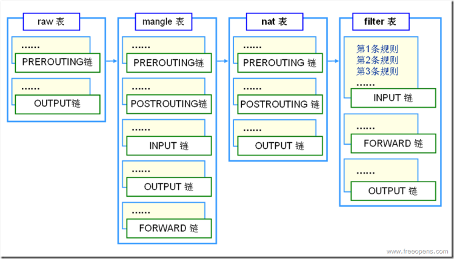

iptables详解
------

### iptables基础
netfilter/iptables（简称为iptables）组成Linux平台下的包过滤防火墙，与大多数的Linux软件一样，这个包过滤防火墙是免费的，它可以代替昂贵的商业防火墙解决方案，完成封包过滤、封包重定向和网络地址转换（NAT）等功能。
>Iptables采用“表”和“链”的分层结构。在REHL4中是三张表五个链。现在REHL5成了四张表五个链了



| 表名 | 包含的链 | 作用 |
| ---- | ----- | -----|
| filter表 | INPT、FORWARD、OUTPUT| 过滤数据包|
| NAT表 | PREROUTING、POSTROUTING、OUTPUT |用于网络地址转化（IP、端口）|
| Mangle表|PREOUTING、POSTROUTING、INPUT、OUTPUT、FORWARD|修改数据包的服务类型、TTL|
|Raw | OUTPUT、PREROUTING|决定数据包是否被状态跟踪机制处理|


|链名|作用|
|----|----|
|INPUT|进来的数据包应用此规则链中的策略|
|OUTPUT|外出的数据包应用此规则链中的策略|
|FORWARD|转发数据包时应用此规则链中的策略|
|PREROUTING|对数据包作路由前应用此链中的规则（所有的数据包进来的时候都先由这个链处理）|
|POSTROUTING|对数据包作路由选择后应用此链中的规则(所有的数据包出来的时候都先由这个链处理)|


参数说明

|参数|说明|
|-----|----|
|-A |在指定链的末尾添加（append）一条新的规则|
|-D| 删除（delete）指定链中的某一条规则，可以按规则序号和内容删除|
|-I| 在指定链中插入（insert）一条新的规则，默认在第一行添加|
|-R| 修改、替换（replace）指定链中的某一条规则，可以按规则序号和内容替换|
|-L |列出（list）指定链中所有的规则进行查看|
|-E |重命名用户定义的链，不改变链本身|
|-F |清空（flush）|
|-N |新建（new-chain）一条用户自己定义的规则链|
|-X |删除指定表中用户自定义的规则链（delete-chain）|
|-P |设置指定链的默认策略（policy）|
|-Z |将所有表的所有链的字节和数据包计数器清零|
|-n |使用数字形式（numeric）显示输出结果|
|-v |查看规则表详细信息（verbose）的信息|
|-V |查看版本(version)|
|-h |获取帮助（help）|


### iptables的应用

iptables -t table 命令 chain rules -j target
>   table可以是filter nat mangle 默认是 filter

#### 命令
- -P 或 --policy 定义默认策略
    - iptables -t filter --policy FORWARD DROP
    - iptables -t filter --policy FORWARD ACCEPT

- -A 或--append 在规则列表的最后增加一条规则

- -I 或 --insert 在指定位置插入一条规则、默认是第一条
    - iptables -t filter -I INPUT -p icmp -j DROP  // 禁止  ping
    - iptables -t filter -I INPUT 3 -p icmp -j DROP //指定位置3
        
- -D 或 --delete删除一个规则
    - iptables -t filter -D INPUT 1

- -R 或 --replace 替换规则表的某条规则
    - iptables -t filter -R INPUT 2 -p icmp -j DROP

- -F  清除所有的规则
    - iptables -t filter -F INPUT
    - iptables -F
    - iptables -t filter -F

#### iptables匹配选项

-    -i 或 --in-interface 指定数据包从哪个网络接口进入 如：ppp0、eth0、eth1等
-    -o 或 --out-interface 指定数据包从哪块网络接口输出，如：ppp0、eth0、eth1等
-    -p 或 --protocol协议类型  指定数据包匹配的协议，如TCP、UDP和ICMP等
-    -s 或 --source 指定数据包匹配的源地址
-    -d 或 --destination 指定数据包匹配的目标地址
-    --sport指定数据包匹配的源端口号，可以使用“起始端口-结束端口”的格式指定一个范围的端口
-    --dport 目标端口号，指定数据包匹配的目标端口号，可以使用“起始端口-结束端口”的格式指定一个范围的端口
```
    iptables -t filter -I INPUT -p icmp -i eth3 -j DROP    
    iptables -t filter -I FORWARD -p tcp -s 192.168.8.12/32 --dport 3389 -j DROP //远程桌面  使用的是TCP 3389端口
    iptables -t filter -I FORWARD -s 192.168.80.0/24 -d 192.168.10.0/24 -j ACCEPT
```


#### iptables 扩展匹配选项
-    参数：-m state
    基于状态检测的包过滤，指定检测哪种状态 
    --state {NEW(想要起始一个连接)、ESTATBLISHED（属于某个已经建立的连接）、INVALID（非法连接）、RELATED（属于某个已经建立的连接，所建立的新连接）}
    连接状态共有四种：
    iptables -A INPUT -m state --state RELATED,ESTABLISHED
    iptables -t filter -I FORWARD -s 192.168.10.0/24 -d 192.168.80.0/24 -m state --state NEW -j DROP
    iptables -t filter -I OUTPUT -p tcp -m state --state NEW -j DROP

-    参数：-m icmp --icmp-type
    ping 命令使用icmp协议测试网络是否畅通，icmp有两种常用类型的数据包即icmp-type,常用的类型为echo-reply和echo-request.
    iptables -t filter -I FORWARD -p icmp -m icmp --icmp-type echo-request -j DROP

-    参数：-m multiport
        指定多端口
        --sport
        --dport
        --ports
        拒绝：192.168.80.0/24
        iptables -t filter -I FORWARD -p tcp -m multiport -dport 1:1024,3389

-    参数： -m iprange 
            --src-range ip-ip
            --dst-range ip-ip
        iptables -t filter -I FORWARD -m iprange --src-range 192.168.80.1-192.168.80.100 -j DROP
    
-    限制最大连接数  参数： -m connlimit --connlimit-above 
        iptables -t filter -I INPUT -s 192.168.80.0/24 -d 192.168.10.123/32 -p tcp --dport 3389 -m connlimit --connlimit-above 2 -j DROP//限制最大连接个数
        只允许最大连接数为2
        

-    限制网速 参数：-m limit --limit 
        说明：用来比对某段时间内封包的平均流量，上面的例子是用来比对的，每小时流量是否超过了3个封包
        ```
        iptables -A INPUT -m limit --limit 3/hour
        一个数据包 1500个字节 300*1500 = 450 000 = 450K(300个数据包占用的流量)
        iptables -t filter -I FORWARD -s 192.168.10.0/24 -m limit --limit 300/second -j ACCEPT
        iptables -t filter -I FORWARD -s 192.168.10.0/24 -j DROP

        vim /etc/sysconfig/limit.sh
        for (i=2;i<254;i++)
        do
            iptables -I FORWARD -s 192.168.10.$i -j DROP
            iptables -I FORWARD -s 192.168.10.$i -m limit --limit 300/sec --limit-burst 400 -j ACCEPT
        done
        ```
-    瞬间流量控制 参数：--limit-burst
        ```
        iptables -A INPUT -m limit --limit-burst 5        
        iptables -t filter -I FORWARD -s 192.168.10.123/32 -d 192.168.68.12/32 -p icmp -m limit --limit-burst 4 -j ACCEPT //允许192.168.10.132/32 ping 192.168.80.12/32 前四个
        iptables -t filter -A FORWARD -s 192.168.10.123/32 -d 192.168.68.12/32 -p icmp -m limit --limit-burst 4 -j DROP
        iptables -t filter -Z  //清零iptables的计数器
        ```
-   基于MAC地址过滤流量 参数： -m mac --mac-source
        iptables -A INPUT -m mac --mac-source 00:00:00:00:00:01  //48位的二进制
        数据包带了MAC地址的叫做帧
        说明：用来比对封包来源网络接口的硬件地址，这个参数不能在OUTPUT和POSTROUTING
        拒绝本机访问VMNet8
        iptables -t tables -I INPUT -s 192.168.199.154/32 -d 192.168.85.3/32 -m mac --mac-source 00-00-00-00-00-00-00-E0 -j DROP
    

####    处理动作
    -j 参数用来指定要进行的处理动作，常用处理动作包括：ACCEPT、REJECT、DROP、REDIRECT、MASQUERADE、LOG、DNAT、SNAT、MIRROR、QUEUE、RETURN、MARK。
        filter表能使用的主要动作：
            ACCEPT：
            REJECT：拦阻该封包，并传送封包通知对方，可以传送封包有几个选择；iptables -t filter -I INPUT -s 192.168.85.1/32 -p icmp -j REJECT
            DROP：丢弃封包不予处理
            LOG：将封包相关讯息记录在/var/log/message中，详细位置请查阅/etc/syslog.conf配置文件，进行完此处理动作，将会继续匹配器规则
                eg：iptables -t filter -I INPUT -p icmp -j LOG --log-prefix "iptables icmp-localhost"
iptables -t nat -I FW_NAT_AUTH -j LOG --log-prefix "iptables user_auth"     //--log-level notice


B 信息等级的指定方式
   1）. xxx: 表示大于xxx级别的信息
   2）.=xxx：表示等于xxx级别的信息
   3）.!xxx：表示在xxx之外的等级的信息

|数字|英文名称|说明|
|----|----|----|
|0 |debug |–有调式信息的，日志信息最多|
|1 |info |一般信息的日志，最常用|
|2| notice |最具有重要性的普通条件的信息|
|3 |warning |警告级别|
|4 |err |错误级别，阻止某个功能或者模块不能正常工作的信息|
|5 |crit |严重级别，阻止整个系统或者整个软件不能正常工作的信息|
|6 |alert |需要立刻修改的信息|
|7 |emerg |内核崩溃等严重信息导致系统几乎要死机|

> 打开（cat /etc/rsyslog.conf）修改日志记录方式:kern.warning /var/log/iptables.log

iptables -t filter -I INPUT -j LOG --log-prefix "iptables user_auth"
iptables -t filter -I INPUT -j LOG --log-prefix "iptables denied: " --log-level 7

#### 保存还原防火墙设置
    cat /etc/sysconfig/iptables
    iptables-save > iptables.coonf1
    iptables-restore < iptables.conf1

#### 介绍iptables防火墙配置文件  /etc/sysconfig/iptables-config
    IPTABLES_MODULES="ip_conntrack-ftp ip-nat_ftp"
    service iptables status
    iptables -L -v
    iptables -L -vn // -n 以数字的形式显示IP地址和端口
    service iptables restart


#### mangle表的应用案例
    用来修改数据表的首部，ttl
    iptables -t mangle -A PREROUTING -i eth0 -j TTL --ttl-set 30  //设置TTL的值  ttl(128(window),64(linux))
    pathing、tracert
    ping 172.16.1.137 -i 3  // -i  设置TTL的值
    tracert 172.16.1.137

    iptables -t mangle -A PREROUTING -i eth3 -j TTL --ttl-inc 1
