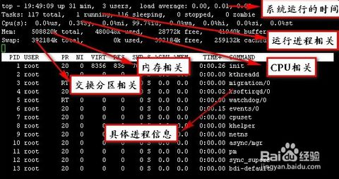

top
------
top命令会展示进程的实际活动。默认情况下，它会列出系统上所有CPU密集型任务，并且每5秒钟刷新一次列表。你可以对PID（数值），生存时间（最新的排最前面），时间（累计时间）以及常驻内存使用率和时间（进程启动开始占用CPU的时间）进行排序。

### top命令还有如下几个常用的快捷键：
| 参数 | 说明 |
| ----- | ----- |
|t| 关闭和开启进程汇总信息的展示|
|m|关闭和开启内存信息的显示|
|A|排序系统上各类资源的排序。对于快速找出系统上的性能问题的任务很有帮助。|
|f|进入top的交互配置模式，对于给top设置特定的进程很有用|
|o|让你交互的选择top的排序|
|r|使用renice命令|
|k|使用kill命令|
|q|退出top命令|
|<space\>|立即刷新|
|s|设置刷新时间间隔|
|c|显示命令完全模式|
|t|显示或隐藏进程和CPU状态信息|
|m|显示或隐藏内存状态信息|
|l|显示或隐藏uptime信息|
|f|增加或减少进程显示标志|
|S|累计模式，会把已完成或退出的子进程占用的CPU时间累计到父进程的MITE+|
|P|按%CPU使用率排行|
|T|按MITE+排行|
|M|按%MEM排行|
|u|指定显示用户进程|
|r|修改进程renice值|
|k|kill进程|
|i|只显示正在运行的进程|
|W|保存对top的设置到文件^/.toprc，下次启动将自动调用toprc文件的设置|
|h|帮助命令|
|q|退出|