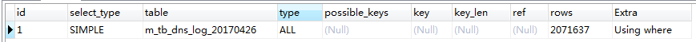

读懂MySQL执行计划
------
### 执行计划是什么？
执行计划，简单的来说，是SQL在数据库中执行时的表现情况,通常用于SQL性能分析,优化等场景。在MySQL使用 explain 关键字来查看SQL的执行计划。如下所示:
`EXPLAIN select * FROM m_tb_dns_log_20170426 where sSrcIP='172.16.2.100';`
通过执行上条语句我们得到：


------
|列|说明|
|---|-------|
|id|表示查询中select操作表的顺序,按顺序从大到依次执行|
|select_type |该表示选择的类型,可选值有: SIMPLE(简单的)|
|type |该属性表示访问类型,有很多种访问类型。最常见的其中包括以下几种: ALL(全表扫描), index(索引扫描),range(范围扫描),ref (非唯一索引扫描),eq_ref(唯一索引扫描,),(const)常数引用, 访问速度依次由慢到快。其中 : range(范围)常见与 between and …, 大于 and 小于这种情况。提示 : 慢SQL是否走索引,走了什么索引,也就可以通过该属性查看了。|
|table |表示该语句查询的表|
|possible_keys |顾名思义,该属性给出了,该查询语句,可能走的索引,(如某些字段上索引的名字)这里提供的只是参考,而不是实际走的索引,也就导致会有possible_Keys不为null,key为空的现象。|
|key |显示MySQL实际使用的索引,其中就包括主键索引(PRIMARY),或者自建索引的名字。|
|key_len |表示索引所使用的字节数|
|ref |连接匹配条件,如果走主键索引的话,该值为: const, 全表扫描的话,为null值|
|rows |扫描行数,也就是说，需要扫描多少行,采能获取目标行数,一般情况下会大于返回行数。通常情况下,rows越小,效率越高, 也就有大部分SQL优化，都是在减少这个值的大小。注意:  理想情况下扫描的行数与实际返回行数理论上是一致的,但这种情况及其少,如关联查询,扫描的行数就会比返回行数大大增加)|
|Extra|这个属性非常重要,该属性中包括执行SQL时的真实情况信息,如上面所属,使用到的是”using where”，表示使用where筛选得到的值,常用的有:“Using temporary”: 使用临时表 “using filesort”: 使用文件排序|


数据库查询快慢是影响项目性能的一大因素，对于数据库，我们除了要优化 SQL，更重要的是得先找到需要优化的SQL。如何找到低效的SQL是写这篇文章的主要目的。MySQL 数据库有一个“慢查询日志”功能，用来记录查询时间超过某个设定值的SQL，这将极大程度帮助我们快速定位到症结所在，以便对症下药。

一、开启慢日志设置
    SET global slow_query_log  = ON
    SET global long_query_time = 3;
    SET global log_output = 'FILE,TABLE';
    set GLOBAL query_cache_size = 134217728;

配置文件
　　以配置文件的方式设置，需要重启 MySQL 服务。在 my.ini 中的 [mysqld] 下：
        或者修改# 慢日志相关配置
        slow_query_log = ON
        long_query_time = 1

二、查看慢日志存放位置
    show variables like '%query%';


三、查看是否开启了缓存
    show VARIABLES like "%cache%";

```
show variables like '%query%';
show VARIABLES like "%cache%";  #查看缓存开启状态
show STATUS like "%qcache%";        #查看缓存命中情况
SHOW STATUS LIKE 'Qcache%';         #查看缓存命中情况
SHOW STATUS LIKE 'open%tables'; #显示打开表的活动
SHOW STATUS LIKE 'threads%';        #显示线程使用统计信息
show status like '%key_read%';      #确定关键字效率
SHOW STATUS LIKE 'created_tmp%';  #确定临时表的使用
SHOW STATUS LIKE "sort%";               #显示排序统计信息
SHOW STATUS LIKE "com_select";  #确定表扫描比率
SHOW STATUS LIKE "handler_read_rnd_next";#Handler_read_rnd_next /Com_select 得出了表扫描比率 —— 在本例中是 521:1。如果该值超过4000，就应该查看 read_buffer_size，例如read_buffer_size = 4M。如果这个数字超过了8M，就应该与开发人员讨论一下对这些查询进行调优了！
SHOW VARIABLES LIKE '%query_cache%';#查看数据库缓存配置情况
#如果你查询的表更新比较频繁，而且很少有相同的查询，最好不要使用查询缓存
show global variables like '%secure%'; 
SET global slow_query_log  = ON;
set GLOBAL query_cache_size = 134217728;
set table_cache =5000; #设置默认打开表数量
set thread_cache = 40; #增大线程缓存
```